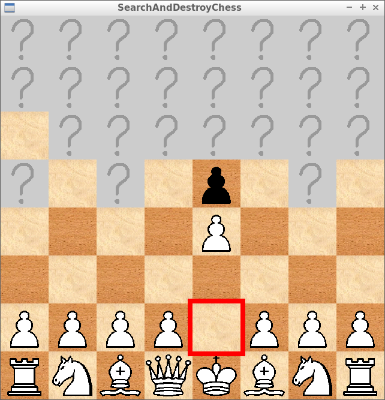
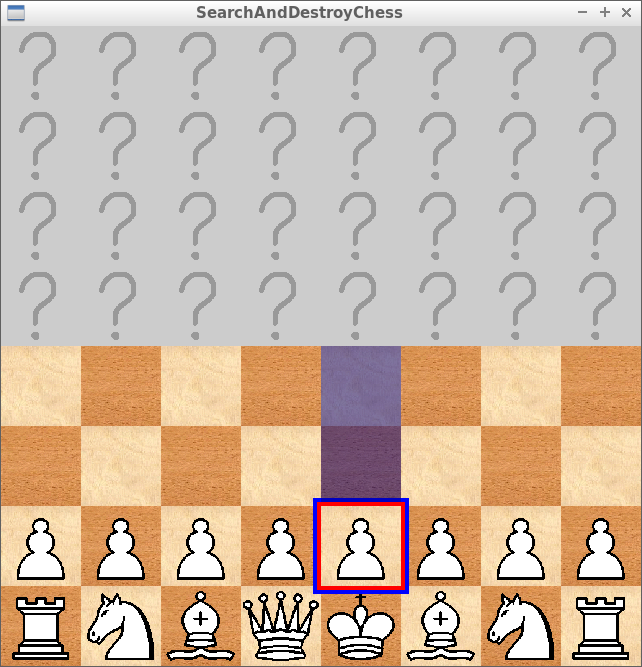
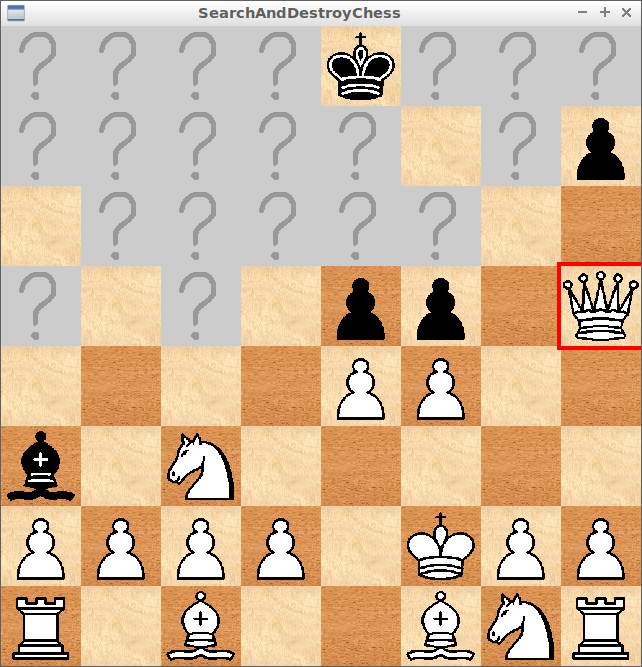

# Search And Destroy Chess 2

Branch   |
---------|------------------------------------------------------------------------------------------------------------------------
`master` |
`develop`|

Search And Destroy Chess 2,
the successor of [Search And Destroy Chess](https://github.com/richelbilderbeek/SearchAndDestroyChess),
written in Rust.

## Screenshots

These are from [Search And Destroy Chess](https://github.com/richelbilderbeek/SearchAndDestroyChess),
as Search And Destroy Chess 2 has no GUI yet.

